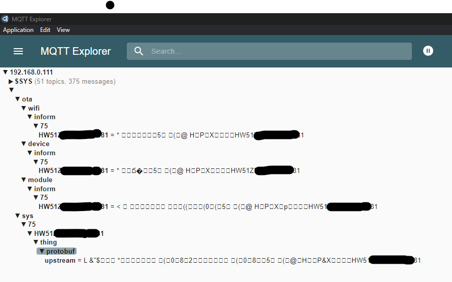
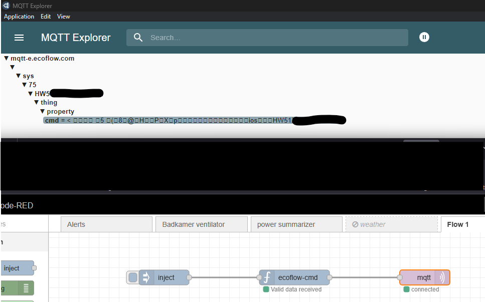

# local-powerstream
Knowledge gathering hub with the goal to control the ecoflow powerstream locally without internet

# History
If you arrived here, I probably do not need to come up with reasons why you would want to be able to control a device's basic functionality without asking the manufacturer if you are allowed to do so. But I will tell you a bit my story as background info.
I found the powerstream in my search for a DIY home battery solution (that started by reading this Dutch forum thread: https://gathering.tweakers.net/forum/list_messages/2253584/0) that met all the criteria:
1) the solar inputs can handle the 24V battery as input
2) the power output can be set from 0 to 800W through automation.
3) The device is certified (by our local regulator) to be plugged in a socket in the house.
But there is one big problem left to solve: setting the powerstreams output power without going through a cloud API call. Every IOT or smart device in my home connects to a separate network without internet access, that is simply how my setup is. (my phone has constant VPN to my home server and that server has access to the devices)

# Asking ecoflow nicely will not work
I mailed support with my concerns, mostly because I wanted to see what their response would be. The response was a very general "we see what you ask for and pass it on to our development team". I do not think that not having a local API is caused by the development team. This is 100% a business decision.
Ecoflow is looking into a paid subscription model for functionality that depends on the cloud. The powerstream is relativly cheap (compared to their batteries). They go out of stock in every country. They need to get people hooked on the cloud functionality and want to set up a subscription model later and sell this as "paying for usage of their infrastructure".
Making a local API now would undermine this business strategy.

# The BLE route ~~will not work~~ might work?
It seems the powerstream can be somewhat controlled with bluetooth,
but I have no experience in bluetooth reverse engineering also since bluetooth is short ranged it is less practical.

# Tricking the device into connecting to my own mosquitto server
Using adguard I could see that the device is connecting to mqtt-e.ecoflow.com - it was pretty easy to add a DNS rewrite and route this to the IP of my own mosquitto server.
Basically if you have any Ubuntu VM running, copy whatever is in the mqttserver subfolder in your home folder. Edit the docker-compose.yml to match the home folders name. Then go to certs subdir and follow the readme there to create a self-signed certificate.  
  
I was going **"YES"** to see topics appear and all kinds of telemetry from the device being published. This was the most important step, as this meant I could basically get the device talk to my local server.

I noticed the upstream topic and the most logical way the server sets the power output is putting something on a corresponding inbound topic.
The data is in a protobuf binary format, as a next step we need to get this binary format decoded.
--  
I created an issue to tackle this one, any help is welcome:
https://github.com/tomvd/local-powerstream/issues/1

# Impersonating a device to see what the possible downstream command could be
In the local mosquitto log you can see it subscribes to a lot of topics:
````
/sys/.../thing/protobuf/downstream
/sys/.../thing/rawData/downstream
/sys/.../thing/property/cmd
/sys/.../thing/property/set
a few /ota/wifi topics - probably not interesting to us
a few /ota/module topics
````
I probably want to find out what the ecoflow mothership is sending to the device on those 4 first topics...   

Using a honeypot-mosquitto server (little python app you can find in the honeypot folder) it is possible to log credentials from any connecting client.
You should see something like this:
````
2025-04-01 19:47:59,749 - MQTT TLS Honeypot started on port 8883
2025-04-01 19:48:01,303 - Connection from ('192.168.0.227', 50249)
2025-04-01 19:48:01,814 - SSL/TLS handshake successful with ('192.168.0.227', 50249)
2025-04-01 19:48:01,830 - data recvb"\x10h\x00\x04MQTT\x05\xc2\x00x\x00\x00\x10HW51012345678901\x00'device-01234567890123456789012345678901\x00 01234567890123456789012345678901"
2025-04-01 19:48:01,831 - Error parsing MQTT packet: index out of range
````
(I changed the credentials to fake ones)
With the self-signed certificate, clientid HW51012345678901, userid device-01234567890123456789012345678901, password 01234567890123456789012345678901
you can actually connect to mqtt-e.ecoflow.com:8883 using mqtt explorer.  
Then I used the nodered plugin to change the output power of the device, which actually mimics the command that is send by the app.
Suddenly I see the topic and payload appear on MQTT explorer, which means we probably now can use that one to control the powerstream locally.

However, we are not there yet. I can send commands to the device to change its power level, and it replies, but does not do anything yet.
You can follow the latest tests in this thread  
https://github.com/tomvd/local-powerstream/issues/4

# psbridge - a small bridge app between the ecoflow mosquitto server and my home assistant mosquitto server
This is more a matter of taste but I wanted to use tiny Java/micronaut app which is also easy to build and deploy as a container.
Java has excellent mqtt and protobuf libraries. And my mother tongue is Java, hence this choice.  
-- I am working on it: https://github.com/tomvd/local-powerstream/issues/3
