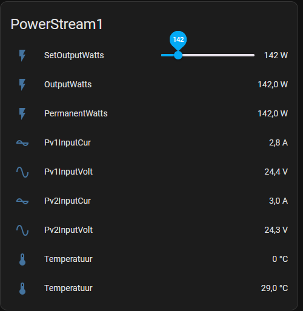

# local-powerstream
Knowledge gathering hub with the goal to control the ecoflow powerstream locally without internet

# History
I found the powerstream in my search for a DIY home battery solution (that started by reading this Dutch forum thread: https://gathering.tweakers.net/forum/list_messages/2253584/0) that met all the criteria:
1) the solar inputs can handle the 24V battery as input
2) the power output can be set from 0 to 800W through automation.
3) The device is certified (by our local regulator) to be plugged in a socket in the house.

But there is one big problem left to solve: make it work without the Ecoflow cloud. (for various reasons) 

# Tricking the device into connecting to my own mosquitto server
Using Adguard (you can also use pihole) I could see that the device is connecting to mqtt-e.ecoflow.com - it was pretty easy to add a DNS rewrite and route this to the IP of my own mosquitto server.
Basically if you have any Ubuntu VM running, copy whatever is in the mqttserver subfolder in your home folder. Edit the docker-compose.yml to match the home folders name. Then go to certs subdir and follow the readme there to create a self-signed certificate. Compose it all up and off we go.  
  
If you connect with MQTT explorer to your local server and see topics appear and all kinds of telemetry from the device being published as shown below you are all set to controle the device locally:

The data is in a protobuf binary format, as a next step we need to get this binary format decoded. Later I found out that using https://mqttx.app/ and set the output to base64 was actually much better to handle binary communication. The proto definitions are very similar to the ones already found in the decompiled android app. (There is a the inverter heartbeat for example that contains all kind of info like PV input voltage)

# Impersonating a device to see what the possible downstream command could be
In the local mosquitto log you can see it subscribes to a lot of topics:
````
/sys/.../thing/protobuf/downstream
/sys/.../thing/rawData/downstream
/sys/.../thing/property/cmd
/sys/.../thing/property/set
a few /ota/wifi topics - probably not interesting to us
a few /ota/module topics
````
I probably want to find out what the ecoflow mothership is sending to the device on those 4 first topics...   

Using a honeypot-mosquitto server (little python app you can find in the honeypot folder) it is possible to log credentials from any connecting client.
You should see something like this:
````
2025-04-01 19:47:59,749 - MQTT TLS Honeypot started on port 8883
2025-04-01 19:48:01,303 - Connection from ('192.168.0.227', 50249)
2025-04-01 19:48:01,814 - SSL/TLS handshake successful with ('192.168.0.227', 50249)
2025-04-01 19:48:01,830 - data recvb"\x10h\x00\x04MQTT\x05\xc2\x00x\x00\x00\x10HW51012345678901\x00'device-01234567890123456789012345678901\x00 01234567890123456789012345678901"
2025-04-01 19:48:01,831 - Error parsing MQTT packet: index out of range
````
(I changed the credentials to fake ones)
With the self-signed certificate, clientid HW51012345678901, userid device-01234567890123456789012345678901, password 01234567890123456789012345678901
you can actually connect to mqtt-e.ecoflow.com:8883 using mqtt explorer.  
Then I used the nodered plugin to change the output power of the device, which actually mimics the command that is send by the app.
Suddenly I see the topic and payload appear on MQTT explorer, which means we probably now can use that one to control the powerstream locally. It uses the cmd topic for that.

You can use this site to decode base64 protobuf messages (without needing the proto definition file): https://protobuf-decoder.netlify.app/

A few tests later, I could control the device by creating my own protobuf message, in my little java app like this: 
````
    public byte[] convert(int watts, String sn) {
        int deciWatts = Math.max(1, watts*10);
        setMessage setMessage = com.tomvd.psbridge.setMessage.newBuilder()
                .setHeader(com.tomvd.psbridge.setHeader.newBuilder()
                        .setPdata(com.tomvd.psbridge.setValue.newBuilder()
                                .setValue(deciWatts)
                                .build())
                        .setSrc(32)
                        .setDest(53)
                        .setDSrc(1)
                        .setDDest(1)
                        .setCheckType(3)
                        .setCmdFunc(20)
                        .setCmdId(129)
                        .setDataLen(deciWatts > 127?3:2)
                        .setNeedAck(1)
                        .setSeq((int)(System.currentTimeMillis()/1000))
                        .setVersion(19)
                        .setPayloadVer(1)
                        .setFrom("ios")
                        .setDeviceSn(sn)
                        .build())
                .build();
        return setMessage.toByteArray();
    }
````
That is the code to create the payload. You just have to publish that to the /sys/.../thing/property/cmd topic.

Firmware: 1.1.4.61

# psbridge - a small bridge app between the ecoflow mosquitto server and my home assistant mosquitto server
This is more a matter of taste but I wanted to use tiny Java/micronaut app which is also easy to build and deploy as a container.
Java has excellent mqtt and protobuf libraries. And my mother tongue is Java, hence this choice.   
This app is still under development, but it already allows for getting powerstream parameters and setting the output voltage through homeassistant (it send an mqtt discovery topic and then your powerstream will appear):   


# disclaimer
The app, docker file, python script and everything I described here comes without warranties and limited support, it was created for my own use and made public to inspire and educate other people to create or extend their own plugins or apps. If you get into trouble with unofficial use of the device, support will probably not help you.   
I will not take any requests to support other devices.   
The intention of this project is not to do harm to Ecoflow, only to make use of my device without giving it a constant internet connection. 